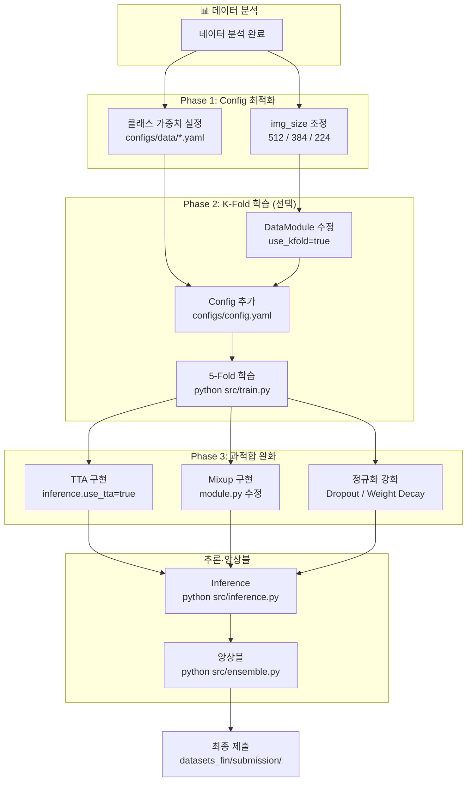

# 훈련 작업 가이드 (Operation Manual)

> 모든 모델/데이터/학습 조합의 실행 스크립트 및 설명

**최종 업데이트**: 2026-03-01
**프로젝트**: 문서 이미지 분류 (목표 F1 0.95, 퍼블릭 리더보드)
**현재 베스트**: 퍼블릭 **0.9441** (MaxVit-Base-384, run_003) — Val F1 0.961 대비 갭 약 0.01으로 축소

---

## 🆕 최신 업데이트 (2026-03-01) — 이진분류기 보정 Phase 2 (α 파라미터 + Grid Search)

### 개요

`research.md §7.2`의 Phase 2 구현: Confidence Routing + α 파라미터로 class 3·7 보정 정밀도 향상.
시나리오 B(메인이 맞고 이진분류기가 틀림) 피해를 동적 α로 방지하고, validation set grid search로 최적 θ·α를 자동 탐색.

### 신규 / 변경 파일

| 파일 | 상태 | 설명 |
|------|------|------|
| `binary_ensemble.sh` | 신규 | 전체 파이프라인 셸 스크립트 (SSH 종료 후에도 지속 실행) |
| `src/utils/binary_ensemble.py` | 신규 | Phase 1+2 핵심 보정 로직 모음 |
| `scripts/apply_binary_ensemble.py` | 변경 | Phase 2 파라미터·grid search·히트맵 시각화 추가 |
| `configs/binary/apply_ensemble.yaml` | 변경 | mode, alpha, theta, dynamic_alpha, grid search 설정 추가 |

### `src/utils/binary_ensemble.py` 주요 함수

| 함수 | 설명 |
|------|------|
| `proportional_redistribution()` | Phase 1: 비례 재배분 |
| `weighted_correction()` | Phase 2: α 가중 평균 보정 (고정/동적 α) |
| `binary_correction()` | 통합 함수 — `mode`로 분기 |
| `grid_search_params()` | validation set 기준 θ × α grid search |
| `make_fallback_p_bin()` | 이진분류기 없을 때 메인 확률로 대체 |

### 보정 모드 (`binary.mode`)

| mode | 설명 | α 사용 | θ 사용 |
|------|------|--------|--------|
| `proportional` | Phase 1 비례 재배분 | ✗ | ✗ |
| `weighted` | α 가중 평균 (전체 샘플) | ✓ | ✗ |
| `routing` | `pool > θ`인 샘플에만 weighted 보정 (권장) | ✓ | ✓ |

### α 파라미터 — 동적 감소 (`dynamic_alpha: true`)

메인 분류기가 class 3 또는 7에 대해 높은 확신(`> confidence_threshold`)을 가질 때 α를 선형 감소시켜, 이진분류기 오답으로 인한 역보정을 방지합니다.

```
max_conf = max(p_main[3], p_main[7])

max_conf ≤ 0.7 → α 그대로 (보정 강하게)
max_conf = 0.85 → α × 0.5
max_conf = 1.0  → α = 0  (보정 안 함)
```

### Grid Search (`binary.grid_search: true`)

validation set에서 F1-Macro를 최대화하는 (θ, α) 조합을 탐색하고, 그 값으로 test set 보정을 즉시 진행합니다.

결과물:
- `*_grid_search.json` — 전체 탐색 결과 (F1 내림차순)
- `*_grid_search.png` — θ × α 히트맵 (routing) 또는 α 막대 그래프 (weighted)

### 실행 방법

```bash
# Phase 1 (기존 동작 유지)
python scripts/apply_binary_ensemble.py \
  data=transformer_384 \
  binary=apply_ensemble \
  ensemble=ensemble_384_3models

# Phase 2: routing 모드 + 동적 α
python scripts/apply_binary_ensemble.py \
  data=transformer_384 \
  binary=apply_ensemble \
  binary.mode=routing \
  binary.alpha=0.8 \
  binary.theta=0.3 \
  binary.dynamic_alpha=true

# Phase 2: grid search로 최적 θ·α 탐색 후 자동 적용
python scripts/apply_binary_ensemble.py \
  data=transformer_384 \
  binary=apply_ensemble \
  binary.mode=routing \
  binary.grid_search=true

# 2차 세밀 탐색 (범위 좁히기)
python scripts/apply_binary_ensemble.py \
  data=transformer_384 \
  binary=apply_ensemble \
  binary.mode=routing \
  binary.grid_search=true \
  binary.grid_search_theta_min=0.2 \
  binary.grid_search_theta_max=0.5 \
  binary.grid_search_theta_step=0.02 \
  binary.grid_search_alpha_min=0.7 \
  binary.grid_search_alpha_max=1.0 \
  binary.grid_search_alpha_step=0.05
```

### `binary_ensemble.sh` — 원클릭 전체 파이프라인

SSH/VPN을 종료해도 서버에서 계속 실행되는 자동 백그라운드 스크립트.
실행하면 즉시 터미널이 반환되고, 로그 파일에서 진행 상황을 확인합니다.

#### 기본 실행

```bash
# 프로젝트 루트에서 실행 권한 부여 (최초 1회)
chmod +x binary_ensemble.sh

# 전체 파이프라인 실행 (Step 1 학습 → Step 2 보정 앙상블)
./binary_ensemble.sh
# ======================================================
#   이진분류기 파이프라인 — 백그라운드 실행
#   PID    : 12345
#   로그   : logs/binary_ensemble_20260301_120000.log
#   실시간 확인 : tail -f logs/binary_ensemble_20260301_120000.log
#   강제 종료   : kill 12345
# ======================================================
```

#### 주요 옵션

| 옵션 | 설명 |
|------|------|
| *(없음)* | 전체 파이프라인 (Step 1 학습 + Step 2 proportional 보정) |
| `--skip-train` | Step 1 건너뜀 — 기존 체크포인트로 Step 2만 실행 |
| `--mode=routing` | Phase 2 routing 모드로 보정 (`pool > θ`인 샘플에만 적용) |
| `--mode=weighted` | Phase 2 weighted 모드 (전체 샘플에 α 가중 평균) |
| `--alpha=0.8` | 보정 강도 (0.0=보정 없음, 1.0=완전 재배분) |
| `--theta=0.3` | routing 임계값 (pool > θ인 샘플만 보정) |
| `--grid-search` | validation set에서 최적 θ·α 탐색 후 자동 적용 |
| `--no-tta` | TTA 비활성화 (추론 속도 우선 시) |
| `--tta-level=heavy` | TTA 강도 변경 (`light` \| `standard` \| `heavy`) |
| `--ensemble=<name>` | 메인 분류기 앙상블 config 변경 |

#### 사용 시나리오

```bash
# 시나리오 1: 처음부터 전체 실행 (기본 proportional)
./binary_ensemble.sh

# 시나리오 2: 이미 학습된 체크포인트로 보정만 재실행
./binary_ensemble.sh --skip-train

# 시나리오 3: Phase 2 routing 모드 + grid search
./binary_ensemble.sh --skip-train --mode=routing --grid-search

# 시나리오 4: routing 모드, 파라미터 수동 지정
./binary_ensemble.sh --skip-train --mode=routing --alpha=0.9 --theta=0.25

# 시나리오 5: 다른 앙상블 config 사용
./binary_ensemble.sh --skip-train --ensemble=MaxViT_kfold_0301
```

#### 실행 중 관리

```bash
# 로그 실시간 확인
tail -f logs/binary_ensemble_20260301_120000.log

# 실행 중인 프로세스 확인
ps aux | grep binary_ensemble

# 강제 종료 (출력된 PID 사용)
kill 12345
```

#### 자동 체크포인트 수집

Step 1 학습 완료 후 `checkpoints/binary/fold_results.json`을 파싱해
실제 저장된 체크포인트 경로를 Step 2에 자동으로 전달합니다.
`fold_results.json`이 없으면 `configs/binary/apply_ensemble.yaml`의 기본 경로를 사용합니다.

#### 출력물

| 파일 | 설명 |
|------|------|
| `logs/binary_ensemble_YYYYMMDD_HHMMSS.log` | 전체 실행 로그 (타임스탬프 포함) |
| `checkpoints/binary/fold_*/best*.ckpt` | 이진분류기 체크포인트 (Step 1) |
| `checkpoints/binary/fold_results.json` | fold별 val_f1·경로 요약 (Step 1) |
| `datasets_fin/submission/submission_binary_ensemble_maxvit.csv` | 최종 제출 파일 (Step 2) |
| `datasets_fin/submission/*_grid_search.json` | grid search 결과 (--grid-search 시) |
| `datasets_fin/submission/*_grid_search.png` | θ×α 히트맵 (--grid-search 시) |

---

### 실행 흐름 테스트 결과 (2026-03-01)

`train_binary_classifier.py` 및 `apply_binary_ensemble.py` 전체 흐름을 단계별로 검증한 결과입니다.

#### `apply_binary_ensemble.py` 테스트 결과

| 단계 | 내용 | 결과 |
|------|------|------|
| 구문 검사 | `py_compile` | ✅ |
| 모듈 임포트 | `binary_ensemble` 전체 | ✅ |
| `proportional_redistribution()` | pool 보존, shape (N,17) | ✅ |
| `weighted_correction()` | 고정·동적 α, shape (N,17) | ✅ |
| `binary_correction()` | 3가지 모드 | ✅ |
| `grid_search_params()` | baseline·best·results 반환 | ✅ |
| `make_fallback_p_bin()` | sum=1.0 보장 | ✅ |
| `_plot_grid_search_heatmap()` | routing 히트맵 PNG 생성 | ✅ |
| `sklearn` 격리 | grid_search 외 미사용 시 import 없음 | ✅ |

#### `train_binary_classifier.py` 테스트 결과

| 단계 | 내용 | 결과 |
|------|------|------|
| Step 1 | `prepare_binary_csv()` — 200개 (class3=99, class7=101) | ✅ |
| Step 2 | `DocumentImageDataModule` 5-Fold — 160 train / 40 val | ✅ |
| Step 3 | `DocumentClassifierModule(num_classes=2)` 생성 | ✅ |
| Step 4 | Forward pass `(4,3,224,224)` → `(4,2)`, softmax 합=1.0 | ✅ |
| Step 5 | `fold_results.json` 형식 — 필수 키 모두 존재 | ✅ |
| Step 6 | `Trainer.fit()` 2-epoch E2E — val_f1 정상 기록 | ✅ |
| Step 7 | 체크포인트 로드 (`strict=False`) → `(4,2)` probs | ✅ |
| Step 8 | `binary_correction` 3가지 모드 연결 확인 | ✅ |

#### 확인된 주의 사항

- **`warmup_epochs < epochs` 필수**: `CosineAnnealingLR` 내부에서 `T_max = epochs - warmup_epochs`를 사용하므로, 두 값이 같으면 `T_max=0`이 되어 `ZeroDivisionError` 발생. `default.yaml` 기본값(`warmup_epochs=5, epochs=80`, `T_max=75`)에서는 문제 없음.
- **`strict=False` 로드**: `class_weights`는 `save_hyperparameters(ignore=["class_weights"])`로 제외되므로, 재로드 시 buffer key 불일치가 발생. `apply_binary_ensemble.py`는 이미 `strict=False`로 처리되어 있어 프로덕션에서 문제 없음.
- **`sklearn` 선택적 의존성**: `grid_search_params()` 내부에서만 `f1_score`를 import하므로, sklearn 미설치 환경에서도 `binary_correction()` 등 나머지 함수는 정상 동작.

---

## 🆕 최신 업데이트 (2026-02-28) — 이진분류기 비례 재배분 앙상블 (B-1)

### 혼동 쌍 [3, 7] 전용 이진분류기 앙상블

- ✅ **`scripts/train_binary_classifier.py`**: class 3·7 전용 이진분류기 5-Fold 학습
- ✅ **`scripts/apply_binary_ensemble.py`**: B-1 비례 재배분으로 메인 분류기 확률 보정
- ✅ **`configs/binary/default.yaml`**: 이진분류기 하이퍼파라미터 (MaxViT_Base.in1k, Dropout 0.4, K-Fold 5)
- ✅ **`configs/binary/apply_ensemble.yaml`**: 앙상블 적용 전용 설정

**비례 재배분 원리**: 메인 분류기의 class 3·7 합산 확률(`pool`)을 보존한 채, 이진분류기가 결정한 비율로 재배분. 나머지 15개 클래스 확률은 변경 없음.

---

### Step 1: `train_binary_classifier.py` — 이진분류기 학습

#### 기본 설정 (`configs/binary/default.yaml`)

| 항목 | 기본값 | 설명 |
|------|--------|------|
| `model_name` | `maxvit_base_tf_384.in1k` | 이진분류기 백본 |
| `num_classes` | `2` | class 3 → label 0, class 7 → label 1 |
| `n_folds` | `5` | K-Fold 수 |
| `epochs` | `80` | 최대 에포크 |
| `early_stopping_patience` | `20` | 조기 종료 patience |
| `learning_rate` | `5e-5` | 소규모 데이터 안정적 수렴 |
| `dropout_rate` | `0.4` | 메인(0.1)보다 강한 정규화 |
| `checkpoint_dir` | `checkpoints/binary` | 체크포인트 저장 경로 |

#### 실행 방법

```bash
# 기본 (MaxViT-Base-384, 5-Fold)
python scripts/train_binary_classifier.py data=transformer_384

# 모델 변경 (EfficientNet-B3, 소규모 데이터 과적합 최소화)
python scripts/train_binary_classifier.py \
  data=transformer_384 \
  binary.model_name=tf_efficientnet_b3.ns_jft_in1k

# Fold 수 변경
python scripts/train_binary_classifier.py \
  data=transformer_384 \
  binary.n_folds=3

# 학습률·Dropout 조정
python scripts/train_binary_classifier.py \
  data=transformer_384 \
  binary.learning_rate=1e-4 \
  binary.dropout_rate=0.5
```

#### 결과물

```
checkpoints/binary/
├── fold_0/best.ckpt        # Fold 0 최고 체크포인트
├── fold_1/best.ckpt
├── fold_2/best.ckpt
├── fold_3/best.ckpt
├── fold_4/best.ckpt
└── fold_results.json       # 전체 결과 요약 (val_f1, checkpoint 경로)
```

`fold_results.json` 예시:
```json
{
  "model_name": "maxvit_base_tf_384.in1k",
  "n_folds": 5,
  "avg_val_f1": 0.9324,
  "folds": [
    {"fold": 0, "checkpoint": "checkpoints/binary/fold_0/best.ckpt", "val_f1": 0.9412},
    ...
  ]
}
```

---

### Step 2: `apply_binary_ensemble.py` — 보정 앙상블 적용

학습 완료 후 `configs/binary/apply_ensemble.yaml`의 `binary_checkpoints`를 `fold_results.json`의 경로로 업데이트한 뒤 실행합니다.

```bash
# 비례 재배분 (Phase 1, 기본)
python scripts/apply_binary_ensemble.py \
  data=transformer_384 \
  binary=apply_ensemble \
  ensemble=ensemble_384_3models
```

> Phase 2 (α 파라미터·Grid Search) 실행 방법은 **2026-03-01 섹션** 참조.

---

## 🆕 최신 업데이트 (2026-02-27) — Augmentation 강화 및 timm Mixup 전환, TTA 강화

### Augmentation 강화 및 timm Mixup 전환

#### 1. transformer_384 Augmentation 강화 (`configs/data/transformer_384.yaml`)
- ✅ **SomeOf n: 2 → 3** — 더 다양한 조합 학습
- ✅ **RandomBrightnessContrast 강화**: brightness 0.2→0.3, contrast 0.3→0.4 (대비 std=0.16 반영)
- ✅ **Perspective scale 상한**: 0.1→0.15 (스캔 각도 다양화)
- ✅ **RandomShadow 강화**: shadow_roi 상단 확장(0.5→0.3), num_shadows_limit [1,2]→[1,3]
- ✅ **GaussianBlur 추가** (blur_limit=[3,5]): 스캔 흐림 모사 (moderate 47.5% 대응)
- ✅ **ImageCompression 추가** (quality_range=[60,90]): 스캔 JPEG 열화 모사
- ✅ **GridDistortion 강화**: distort_limit 0.2→0.3, p 0.4→0.5 (66% high distortion 반영)
- ✅ **ElasticTransform 추가** (alpha=80, sigma=6, p=0.25): run_003 대비 yaml 누락 항목 복구
- ✅ **CoarseDropout DocCutout 방향**: 구멍 수 [3,6]→[2,4], 크기 [10,25]→[30,80] (384의 8~20%), p 0.35→0.4

#### 2. timm Mixup 전환 (`src/models/module.py`, `configs/training/transformer.yaml`)
- ✅ **커스텀 MixupCutmix → timm.data.Mixup**: soft label 방식으로 전환 (label_smoothing 통합)
- ✅ **switch_prob: 0.5** 파라미터 추가 — Mixup vs CutMix 50:50 분기
- ✅ **현행 파라미터**: mixup_alpha=0.3, cutmix_alpha=1.0, mixup_prob=0.8, switch_prob=0.5

#### 3. TTA 강화 (`src/utils/tta.py`, `configs/inference/default.yaml`)

- ✅ **3단계 tta_level** 도입: `light`(5) / `standard`(8, D4 완전 집합) / `heavy`(11, D4+스캔 품질)
- ✅ **D4 추가** (standard 이상): `rot180`, `transpose`, `anti_transpose` — 180° 뒤집기·대각선 변환 커버
- ✅ **스캔 품질 TTA** (heavy): `brightness_up`(×1.15), `brightness_down`(×0.85), `sharpen` (3×3 커널)
- ✅ **기본값 `standard`** — 기존 light(5) 대비 rot180/대각선 추가로 방향 커버리지 향상
- ✅ **pseudo_label.py TTA 레벨 연동** — `pseudo.tta_level` 설정으로 제어

```bash
# standard TTA (기본, 8가지 — D4 완전 집합)
python src/inference.py inference.use_tta=true

# heavy TTA (스캔 품질 포함, 11가지)
python src/inference.py inference.use_tta=true inference.tta_level=heavy

# Pseudo-label 생성 시 TTA 레벨 지정
python scripts/pseudo_label.py pseudo.use_tta=true pseudo.tta_level=standard
```
---

## 🆕 최신 업데이트 (2026-02-25)

### 불균형·혼동·Pseudo-label 종합 개선

#### 1. 데이터 불균형 해소
- ✅ **소수 클래스(1,13,14) oversampling**: `minority_class_ids`, `minority_oversample_repeat` 설정으로 제어
- ✅ **혼동 쌍(3,7) 클래스 가중치 보정**: `confusion_pair_extra_weight`로 5-10배 가중치 적용
- ✅ **Class weight CSV 소스**: `class_weights_source: "csv"` 옵션으로 CSV 파일에서 가중치 로드 가능

#### 2. 혼동 클래스(3,7) 대응
- ✅ **Focal Loss**: `loss: "focal"`, `focal_gamma: 2.0` 옵션 추가 (쉬운 샘플 가중치 감소)
- ✅ **3·7 전용 데이터 증강**: `augmentation_confusion_pair_enabled` 설정으로 혼동 쌍 클래스에만 강화 증강 적용 (기본 off)

#### 3. Pseudo-label 개선
- ✅ **Confidence 95% 기본**: 더 엄격한 기준으로 pseudo-label 품질 향상
- ✅ **TTA 기본 false**: 속도 우선, 필요 시 true로 전환
- ✅ **Priority 클래스**: `priority_class_ids: [1, 3, 7, 12, 13, 14]` — weak 클래스 우선 확보

#### 4. 학습 모니터링 강화
- ✅ **Validation 혼동행렬 로깅**: 매 epoch마다 WandB에 혼동행렬 자동 기록
- ✅ **Mixup/CutMix 연동**: training config의 mixup 설정이 모델에 정상 전달

---

## 📐 학습·추론 파이프라인 (Fine-Tuning Flow)

전체 파이프라인 흐름은 아래와 같습니다. `Fine_Tuning_Flow.png`를 참고하여 현재 프로젝트에 맞게 정리했습니다.



### 파이프라인 단계 요약

| Phase | 내용 | 관련 파일 |
|-------|------|----------|
| **데이터 분석** | 데이터셋 구조, 클래스 분포, 이미지 특성 파악 | `scripts/analyze_dataset.py` |
| **Phase 1** | Config 최적화 (img_size, class weights) | `configs/data/*.yaml` |
| **Phase 2** | K-Fold 교차 검증 (선택) | `configs/config.yaml`, `src/data/datamodule.py` |
| **Phase 3** | 과적합 완화 (TTA, Mixup, Dropout, Weight Decay) | `src/utils/tta.py`, `src/models/module.py`, `src/inference.py` |
| **추론·앙상블** | Inference 실행 후 여러 모델 앙상블 | `src/inference.py`, `src/ensemble.py` |

### scripts 디렉토리 스크립트 용도

| 용도 | 스크립트 | 설명 |
|------|----------|------|
| **데이터 탐색** | | |
| 학습 데이터 | `scripts/analyze_dataset.py` | 이미지 크기 분포, 클래스 분포, 메타 정보 분석 |
| 테스트 데이터 | `scripts/analyze_test_dataset.py` | 테스트 데이터 분포·특성, 증강 전략 수립용 상세 분석 (방향, Ink/Paper, 노이즈 등) |
| 데이터 증강 확인 | `scripts/visualize_augmentation.py` | baseline_aug 설정 동작 확인, 원본 vs 증강 이미지 시각화 |
| **모델 벤치마크** | | |
| 벤치마크 테스트 | `scripts/benchmark_models.py` | 여러 모델의 메모리·속도·초기 수렴 속도 비교 (1–2 에포크) |
| **수도 라벨링** | | |
| 수도 라벨링 | `scripts/pseudo_label.py` | 학습된 모델로 테스트 데이터에 pseudo-label 생성 (신뢰도 임계값 이상만) |
| **학습 결과 분석** | | |
| 학습 결과 분석 | `scripts/analyze_results.py` | Confusion Matrix, 클래스별 성능, 오분류 예시 출력 |

> 💡 **참고**: 원본 파이프라인 다이어그램은 `docs/Fine_Tuning_Flow.png`에서 확인할 수 있습니다.

---

## 🖥️ 사용 가능한 환경

### 환경 1: CUDA x86 Server
- **GPU**: CUDA 지원
- **RAM**: 128 GB
- **상태**: ✅ 모든 모델 조합 가능
- **특징**: 대용량 메모리, 고성능 훈련

---

## 📋 목차

1. [빠른 참조](#빠른-참조)
2. [환경별 추천 조합](#환경별-추천-조합)
3. [CUDA 서버 전체 조합](#cuda-서버-전체-조합)
4. [모델별 상세 가이드](#모델별-상세-가이드)
5. [성능 비교 매트릭스](#성능-비교-매트릭스)
6. [트러블슈팅](#트러블슈팅)

---

## 🚀 빠른 참조

본 섹션은 **ConvNeXt-Base**(CNN, 512×512)와 **MaxVit-Base-384**(Transformer, 384×384)를 기준으로 전체 파이프라인(Pseudo-Labeling, K-Fold, 추론, 앙상블)을 구체적으로 설명합니다.

### 학습 파이프라인

| 단계 | 내용 | 프로젝트 구현 | 관련 설정 |
|------|------|---------------|-----------|
| **1** | 기본 학습 | `python src/train.py` | `data`, `model`, `training` |
| **1-1** | 데이터 불균형 해소 | 소수 클래스 oversampling | `data.oversample_minority_classes`, `data.minority_class_ids` |
| **1-2** | 혼동 클래스 대응 | 클래스 가중치 보정 + Focal Loss | `data.confusion_pair_extra_weight`, `training.loss=focal` |
| **1-3** | 혼동 쌍 전용 증강 | 3·7 클래스 강화 증강 (선택) | `data.augmentation.augmentation_confusion_pair_enabled=true` |
| **2** | 수도 라벨링 | `python scripts/pseudo_label.py` | `pseudo.use_tta`, `pseudo.confidence_threshold`, `pseudo.priority_class_ids` |
| **3-1** | 수도 라벨링 포함 학습 (8:2) | `data.pseudo_csv=pseudo_labels.csv` | `data.train_val_split=0.8` (기본값) |
| **3-2** | 수도 라벨링 + K-Fold | `data.pseudo_csv=pseudo_labels.csv` + `data.use_kfold=true` | `data.fold_idx=0~4` |
| **4-1** | 추론 | `python src/inference.py` | `inference.run_id`, `inference.checkpoint`, `inference.use_tta` |
| **4-2** | 앙상블 | `python src/ensemble.py` | `ensemble.method` (soft_voting, hard_voting, rank_averaging) |
| **4-3** | 이진분류기 학습 | `python scripts/train_binary_classifier.py` | `binary.model_name`, `binary.n_folds`, `binary.epochs` |
| **4-4** | 이진분류기 앙상블 (B-1) | `python scripts/apply_binary_ensemble.py` | `binary=apply_ensemble`, `ensemble=*` |

---

## 🎛️ 데이터 불균형 및 혼동 클래스 개선

### 소수 클래스(1,13,14) Oversampling

데이터가 적은 클래스(1: 46장, 13: 74장, 14: 50장)를 반복 추가하여 학습 데이터 균형을 맞춥니다.

```bash
# 기본 학습 (자동으로 소수 클래스 oversampling 적용)
python src/train.py \
  data=transformer_384 \
  model=maxvit_base_384 \
  training=transformer

# 소수 클래스 명시적 지정
python src/train.py \
  data=transformer_384 \
  data.minority_class_ids=[1,13,14] \
  data.minority_oversample_repeat=2 \
  model=maxvit_base_384 \
  training=transformer

# 임계값 기반 자동 탐지 (80장 미만 자동 oversampling)
python src/train.py \
  data=transformer_384 \
  data.minority_oversample_threshold=80 \
  model=maxvit_base_384 \
  training=transformer
```

**설정 옵션**:
- `oversample_minority_classes`: true/false (기본 false)
- `minority_class_ids`: [1, 13, 14] 또는 null (자동 탐지)
- `minority_oversample_repeat`: 반복 횟수 (기본 1)
- `minority_oversample_threshold`: N장 미만 클래스 자동 대상

---

### 혼동 클래스(3,7) 가중치 보정

예측 3-참 7, 예측 7-참 3 같은 혼동이 많이 발생하는 클래스에 5-10배 가중치를 적용합니다.

```bash
# 3·7 클래스 가중치 5배 보정
python src/train.py \
  data=transformer_384 \
  data.confusion_pair_class_ids=[3,7] \
  data.confusion_pair_extra_weight=5.0 \
  model=maxvit_base_384 \
  training=transformer

# 10배 보정 (더 강한 페널티)
python src/train.py \
  data=transformer_384 \
  data.confusion_pair_extra_weight=10.0 \
  model=maxvit_base_384 \
  training=transformer
```

**설정 옵션**:
- `confusion_pair_class_ids`: [3, 7] 또는 다른 클래스 인덱스
- `confusion_pair_extra_weight`: 배수 (1.0 = 보정 없음, 5.0 = 5배, 10.0 = 10배)

---

### Focal Loss (혼동 클래스 집중 학습)

쉬운 샘플의 가중치를 낮춰 어려운 샘플(혼동 클래스)에 더 집중합니다.

```bash
# Focal Loss 사용 (gamma=2.0)
python src/train.py \
  data=transformer_384 \
  model=maxvit_base_384 \
  training=transformer \
  training.loss=focal \
  training.focal_gamma=2.0

# Focal Loss + 가중치 보정 조합
python src/train.py \
  data=transformer_384 \
  data.confusion_pair_extra_weight=5.0 \
  model=maxvit_base_384 \
  training=transformer \
  training.loss=focal \
  training.focal_gamma=2.0 \
  training.label_smoothing_value=0.0

# 더 강한 Focal Loss (gamma=3.0)
python src/train.py \
  data=transformer_384 \
  model=maxvit_base_384 \
  training=transformer \
  training.loss=focal \
  training.focal_gamma=3.0
```

**설정 옵션**:
- `loss`: "cross_entropy" | "label_smoothing" | "focal"
- `focal_gamma`: 2.0 (기본), 3.0 (더 강함)
- **주의**: Focal Loss 사용 시 `label_smoothing_value=0.0` 권장

---

### CosineAnnealingWarmRestarts 스케줄러

학습률을 주기적으로 재시작하여 local minima 탈출을 돕습니다. 긴 fine-tuning이나 멀티-사이클 학습에 유리합니다.

```bash
# cosine_restart 스케줄러 사용 (T_0=15, T_mult=2)
python src/train.py \
  data=transformer_384 \
  model=maxvit_base_384 \
  training=transformer \
  training.scheduler=cosine_restart

# T_0, T_mult 직접 지정
python src/train.py \
  data=transformer_384 \
  model=maxvit_base_384 \
  training=transformer \
  training.scheduler=cosine_restart \
  training.T_0=10 \
  training.T_mult=2
```

**설정 옵션**:
- `scheduler`: `"cosine"` (기본, CosineAnnealingLR) | `"cosine_restart"` (CosineAnnealingWarmRestarts)
- `T_0`: 첫 번째 restart 주기 (epoch 단위). **10~20 권장** (너무 작으면 학습 불안정)
- `T_mult`: 후속 주기 배율
  - `1`: 모든 주기 동일 길이
  - `2`: 후반부 주기가 길어져 fine-tuning에 유리

**cosine vs cosine_restart 비교**:
| 항목 | cosine | cosine_restart |
|------|--------|----------------|
| 패턴 | 단조 감소 | 주기적 재시작 |
| local minima 탈출 | 어려움 | 유리 |
| 적합한 상황 | 안정적 수렴 | 긴 학습, 다양한 minima 탐색 |

---

### 혼동 쌍(3·7) 전용 데이터 증강

3·7 클래스에만 더 강한 augmentation을 적용하여 유사 문서 구분력을 높입니다. **기본값은 비활성화**입니다.

```bash
# 3·7 전용 증강 활성화 (기본 강화 세트 사용)
python src/train.py \
  data=transformer_384 \
  data.augmentation.augmentation_confusion_pair_enabled=true \
  model=maxvit_base_384 \
  training=transformer

# 다른 혼동 쌍 지정 (예: 5와 8)
python src/train.py \
  data=transformer_384 \
  data.augmentation.augmentation_confusion_pair_enabled=true \
  data.confusion_pair_class_ids=[5,8] \
  model=maxvit_base_384 \
  training=transformer
```

**기본 강화 세트** (사용자 지정 없을 시):
- `RandomRotate90(p=0.5)` — 높은 확률로 회전
- `RandomBrightnessContrast(brightness_limit=0.2, contrast_limit=0.2, p=0.5)` — 밝기/대비 조정
- `GaussNoise(var_limit=(10.0, 50.0), p=0.3)` — 노이즈 추가

**설정 옵션**:
- `augmentation_confusion_pair_enabled`: true/false (기본 false)
- `confusion_pair_class_ids`: [3, 7] 또는 다른 클래스
- `confusion_pair_extra_augmentations`: 사용자 정의 증강 리스트 (선택)

---

### Class Weight CSV 소스

실험 재현성을 위해 CSV 파일에서 클래스 가중치를 로드합니다.

```bash
# CSV에서 클래스 가중치 로드
python src/train.py \
  data=transformer_384 \
  data.class_weights_source=csv \
  data.class_weights_csv=".benchmark_results/class_weights.csv" \
  model=maxvit_base_384 \
  training=transformer

# 자동 계산 (train 역빈도, 기본값)
python src/train.py \
  data=transformer_384 \
  data.class_weights_source=auto \
  model=maxvit_base_384 \
  training=transformer
```

**설정 옵션**:
- `class_weights_source`: "auto" (역빈도 계산) | "csv" (CSV 로드)
- `class_weights_csv`: CSV 파일 경로 (data_root 기준 또는 절대 경로)

**CSV 형식** (`.benchmark_results/class_weights.csv`):
```csv
class_id,class_name,count,weight
0,account_number,100,1.00
1,application_for_payment_of_pregnancy_medical_expenses,46,2.17
...
```

---

### 종합 예시: 모든 개선 사항 적용

```bash
# 소수 클래스 oversampling + 3·7 가중치 5배 + Focal Loss + 3·7 전용 증강
python src/train.py \
  data=transformer_384 \
  data.oversample_minority_classes=true \
  data.minority_class_ids=[1,13,14] \
  data.confusion_pair_class_ids=[3,7] \
  data.confusion_pair_extra_weight=5.0 \
  data.augmentation.augmentation_confusion_pair_enabled=true \
  model=maxvit_base_384 \
  training=transformer \
  training.loss=focal \
  training.focal_gamma=2.0 \
  data.pseudo_csv=pseudo_labels.csv 

# CSV 가중치 + Focal Loss 조합
python src/train.py \
  data=transformer_384 \
  data.class_weights_source=csv \
  data.confusion_pair_extra_weight=7.0 \
  model=maxvit_base_384 \
  training=transformer \
  training.loss=focal \
  data.pseudo_csv=pseudo_labels.csv 
```

---

### Step 0: 기본 학습 (Baseline)

두 기준 모델을 먼저 학습합니다.

```bash
# ConvNeXt-Base (CNN, 512×512) — baseline_aug + baseline_512
python src/train.py \
  data=baseline_aug \
  model=convnext_base \
  training=baseline_512

# MaxVit-Base-384 (Transformer, 384×384) — transformer_384 + transformer
python src/train.py \
  data=transformer_384 \
  model=maxvit_base_384 \
  training=transformer
```

| 모델 | Data Config | Training Config | img_size |
|------|-------------|-----------------|----------|
| ConvNeXt-Base | baseline_aug | baseline_512 | 512×512 |
| MaxVit-Base-384 | transformer_384 | transformer | 384×384 |

---

### Step 1: Pseudo-Labeling (수도 라벨링)

학습된 모델로 **test 데이터에 pseudo-label을 생성**하여, 레이블이 없는 데이터를 학습에 활용합니다.

**원리**: test 이미지에 대해 모델 예측을 수행하고, **신뢰도(confidence)가 임계값 이상**인 샘플만 pseudo-label로 채택합니다. 이를 `train.csv`에 추가하여 재학습합니다.

#### 1-1. Pseudo-Label 생성

##### 기본 사용법 (2026-02-25 업데이트)

**새로운 기본값**:
- `confidence_threshold: 0.9` (이전 0.9 → 품질 우선)
- `use_tta: false` (이전 true → 속도 우선, 필요 시 true)
- `priority_class_ids: [1, 3, 7, 12, 13, 14]` (weak 클래스 우선 확보)

```bash
# 1. 기본 (champion 모델, threshold=0.95, TTA 없음)
python scripts/pseudo_label.py

# 2. TTA 사용 (더 신뢰도 높은 pseudo-label, 5배 느림)
python scripts/pseudo_label.py pseudo.use_tta=true

# 3. 신뢰도 임계값 조정
python scripts/pseudo_label.py pseudo.confidence_threshold=0.9  # 더 많은 샘플
python scripts/pseudo_label.py pseudo.confidence_threshold=0.98  # 매우 엄격

# 4. Priority 클래스 설정 (학습 잘 안되는 클래스 위주)
python scripts/pseudo_label.py \
  pseudo.enable_distribution_alignment=true \
  pseudo.priority_class_ids=[1,3,7,12,13,14] \
  pseudo.priority_min_quota=20
```

##### Transformer 모델 (384 크기) 사용 시

**중요**: MaxViT/Swin/ViT 등 384 크기 모델은 반드시 `data=transformer_384` 지정 필요

```bash
# MaxVit-Base-384 모델 (기본 설정: confidence 0.95, TTA false)
python scripts/pseudo_label.py \
  data=transformer_384 \
  pseudo.run_id=20260223_run_008

# MaxVit-Base-384 + TTA + 분포 정렬 (고품질)
python scripts/pseudo_label.py \
  data=transformer_384 \
  pseudo.run_id=20260223_run_008 \
  pseudo.use_tta=true \
  pseudo.enable_distribution_alignment=true \
  pseudo.target_dist_source=train

# MaxVit-Base-384 + Priority 클래스 우선
python scripts/pseudo_label.py \
  data=transformer_384 \
  pseudo.run_id=20260223_run_008 \
  pseudo.enable_distribution_alignment=true \
  pseudo.target_dist_source=train \
  pseudo.priority_class_ids=[1,3,7,12,13,14] \
  pseudo.priority_min_quota=20
```

##### CNN 모델 (512 크기) 사용 시

```bash
# ConvNeXt-Base 모델
python scripts/pseudo_label.py \
  pseudo.run_id=20260222_run_002

# ConvNeXt-Base + TTA
python scripts/pseudo_label.py \
  pseudo.run_id=20260222_run_002 \
  pseudo.use_tta=true
```

##### 분포 정렬 + Priority 클래스

Pseudo-label의 클래스별 비율을 조정하고, weak 클래스를 우선 확보합니다:

```bash
# 1. Train 데이터 분포 + Priority 클래스 (권장)
python scripts/pseudo_label.py \
  data=transformer_384 \
  pseudo.run_id=20260223_run_008 \
  pseudo.enable_distribution_alignment=true \
  pseudo.target_dist_source=train \
  pseudo.priority_class_ids=[1,3,7,12,13,14] \
  pseudo.priority_min_quota=20

# 2. 고품질 + Priority (보수적 + TTA + 분포 정렬)
python scripts/pseudo_label.py \
  data=transformer_384 \
  pseudo.run_id=20260223_run_008 \
  pseudo.use_tta=true \
  pseudo.confidence_threshold=0.95 \
  pseudo.enable_distribution_alignment=true \
  pseudo.target_dist_source=train \
  pseudo.priority_class_ids=[1,3,7,12,13,14]

# 3. 빠른 테스트 (TTA 없음 + 낮은 threshold)
python scripts/pseudo_label.py \
  data=transformer_384 \
  pseudo.run_id=20260223_run_008 \
  pseudo.use_tta=false \
  pseudo.confidence_threshold=0.8

# 4. 현재 예측 분포 사용
python scripts/pseudo_label.py \
  data=transformer_384 \
  pseudo.run_id=20260223_run_008 \
  pseudo.enable_distribution_alignment=true \
  pseudo.target_dist_source=current_run

# 5. EMA 분포 사용 (여러 run의 평균)
python scripts/pseudo_label.py \
  data=transformer_384 \
  pseudo.run_id=20260223_run_008 \
  pseudo.enable_distribution_alignment=true \
  pseudo.target_dist_source=ema \
  pseudo.ema_alpha=0.7
```

**Priority 클래스 옵션**:
- `priority_class_ids`: [1, 3, 7, 12, 13, 14] — 우선 확보할 클래스 인덱스
- `priority_min_quota`: 20 — 각 우선순위 클래스의 최소 확보 개수
- **효과**: 분포 정렬 시 이 클래스들은 최소 개수를 보장받아 학습에 더 많이 활용됨

**분포 정렬 방법**:
- `per_class_cap`: 클래스별 상한 설정 (구현 단순, 권장)
- `ratio_sampling`: 클래스별 목표 개수 정확히 맞춤

**출력 파일**:
- `datasets_fin/pseudo_labels.csv` — 학습용 (ID, target)
- `datasets_fin/pseudo_labels_with_confidence.csv` — 상세 (ID, target, confidence)

**img_size 자동 매칭**: 
- 스크립트가 체크포인트의 `experiment_info.json`에서 학습 시 사용한 img_size를 확인
- 불일치 시 경고 메시지 출력하지만, 명령줄에서 지정한 값을 우선 사용
- **권장**: 체크포인트와 일치하는 data config 지정
  - ConvNeXt (512) → 기본값 또는 `data=baseline_aug`
  - MaxVit-Base-384 (384) → `data=transformer_384` **필수**

#### 1-2. Pseudo-Label을 활용한 재학습

```bash
# ConvNeXt-Base + pseudo-label
python src/train.py \
  data=baseline_aug \
  data.pseudo_csv=pseudo_labels.csv \
  model=convnext_base \
  training=baseline_512

# MaxVit-Base-384 + pseudo-label
python src/train.py \
  data=transformer_384 \
  data.pseudo_csv=pseudo_labels.csv \
  model=maxvit_base_384 \
  training=transformer
```

> 💡 **주의**: `pseudo_labels.csv`는 `datasets_fin/` 기준 상대경로이며, `configs/data/baseline_aug.yaml`, `transformer_384.yaml`에 `pseudo_csv: null`을 override합니다.

---

### Step 2: K-Fold 학습

**Stratified K-Fold**로 클래스 비율을 유지하며 5개 fold로 나누어 학습합니다. 과적합 완화와 더 안정적인 평가가 가능합니다.

#### 2-1. 5-Fold 학습 (각 fold별 실행)

```bash
# ConvNeXt-Base, Fold 0~4
for fold in 0 1 2 3 4; do
  python src/train.py \
    data=baseline_aug \
    data.use_kfold=true \
    data.fold_idx=$fold \
    model=convnext_base \
    training=baseline_512
done

# MaxVit-Base-384, Fold 0~4
for fold in 0 1 2 3 4; do
  python src/train.py \
    data=transformer_384 \
    data.use_kfold=true \
    data.fold_idx=$fold \
    model=maxvit_base_384 \
    training=transformer
done
```

#### 2-2. K-Fold + Pseudo-Label 동시 적용

```bash
# 1) Pseudo-label 생성
python scripts/pseudo_label.py pseudo.use_tta=true

# 2) K-Fold 학습 (pseudo-label 포함)
for fold in 0 1 2 3 4; do
  python src/train.py \
    data=transformer_384 \
    data.use_kfold=true \
    data.fold_idx=$fold \
    data.pseudo_csv=pseudo_labels.csv \
    model=maxvit_base_384 \
    training=transformer
done
```

**설정**: `configs/config.yaml`의 `data.use_kfold`, `data.n_folds`, `data.fold_idx`로 제어됩니다.

---

### Step 3: 추론 (Inference)

학습된 모델로 test 데이터에 대한 예측을 수행하여 제출용 CSV를 생성합니다.

#### 3-1. 기본 추론

```bash
# Champion 모델 사용 (자동 선택)
python src/inference.py

# 특정 run_id 사용
python src/inference.py inference.run_id=20260222_run_001

# 직접 checkpoint 경로 지정
python src/inference.py inference.checkpoint="checkpoints/20260222_run_001/epoch=32-val_f1=0.938.ckpt"
```

#### 3-2. TTA (Test Time Augmentation)

```bash
# standard TTA (기본, 8가지)
python src/inference.py inference.use_tta=true

# heavy TTA (스캔 품질 포함, 11가지)
python src/inference.py inference.use_tta=true inference.tta_level=heavy

# light TTA (빠른 추론)
python src/inference.py inference.use_tta=true inference.tta_level=light

# run_id + TTA
python src/inference.py inference.run_id=20260222_run_002 inference.use_tta=true
```

#### 3-3. 출력 경로 지정

```bash
python src/inference.py inference.output=datasets_fin/submission/convnext_maxvit_ensemble.csv
```

**출력**: `datasets_fin/submission/{model_name}_{run_id}.csv` (기본)

---

### Step 4: 앙상블 (Ensemble)

여러 모델의 예측을 결합하여 단일 모델보다 안정적인 성능을 얻습니다.

#### 4-1. Soft Voting (권장)

각 모델의 **클래스별 확률을 가중 평균**하여 최종 예측합니다.

```bash
# configs/ensemble/default.yaml 기반 (checkpoint 경로 직접 지정)
python src/ensemble.py \
  ensemble.checkpoints=["checkpoints/YYYYMMDD_run_001/epoch=XX-val_f1=X.XXX.ckpt","checkpoints/YYYYMMDD_run_002/epoch=XX-val_f1=X.XXX.ckpt"] \
  ensemble.method=soft_voting \
  ensemble.weights=[0.95,0.93] \
  ensemble.output=datasets_fin/submission/convnext_maxvit_soft.csv
```

#### 4-2. ConvNeXt-Base + MaxVit-Base-384 앙상블 예시

```bash
# configs/ensemble/default.yaml 또는 커스텀 설정으로 실행
python src/ensemble.py \
  ensemble.checkpoints=["checkpoints/YYYYMMDD_run_001/epoch=XX-val_f1=X.XXX.ckpt","checkpoints/YYYYMMDD_run_002/epoch=XX-val_f1=X.XXX.ckpt"] \
  ensemble.method=soft_voting \
  ensemble.weights=[0.95,0.93] \
  ensemble.output=datasets_fin/submission/convnext_maxvit_soft.csv
```

**주의**: 현재 `src/ensemble.py`는 **동일한 img_size** 모델끼리만 앙상블합니다. ConvNeXt(512)와 MaxVit(384)를 혼합하려면:
1. 각 모델로 **별도 inference** 실행 → `convnext.csv`, `maxvit.csv` 생성
2. 확률 CSV를 수동으로 평균하는 스크립트 사용 (또는 동일 해상도 모델만 앙상블)

동일 해상도 예: ConvNeXt(512) + ResNet34(512), 또는 MaxVit(384) + Swin(384)

#### 4-3. K-Fold 5개 모델 앙상블

5-Fold로 학습한 5개 체크포인트를 Soft Voting으로 결합합니다.

```bash
# configs/ensemble/swin_kfold_5models.yaml 참고
# MaxVit K-Fold 5개 체크포인트 경로로 수정 후
python src/ensemble.py ensemble.checkpoints=["ckpt0","ckpt1","ckpt2","ckpt3","ckpt4"] ensemble.method=soft_voting ensemble.weights=[0.93,0.92,0.94,0.91,0.92]
```

#### 4-4. 모든 체크포인트 + 소프트 보팅 + TTA (수도 라벨링 학습 포함)

현재 `checkpoints/` 아래 **동일 img_size**를 가진 모든 run의 best 체크포인트를 자동 수집해 소프트 보팅하고, 각 모델 예측 시 TTA를 적용합니다. (수도 라벨링으로 학습한 모델도 포함됩니다.)

```bash
# 384 모델만 (MaxVit, Swin, DeiT 등) — transformer_384와 쌍으로 사용
python src/ensemble.py data=transformer_384 ensemble=all_runs_soft_tta

# 512 모델만 (ConvNeXt, ResNet 등) — baseline_aug와 쌍으로 사용
python src/ensemble.py data=baseline_aug ensemble=all_runs_soft_tta
```

- **출력**: `datasets_fin/submission/ensemble_all_runs_soft_tta.csv`
- **옵션**: `ensemble.use_tta=true`, `ensemble.use_all_runs=true`로 체크포인트 자동 수집 및 TTA 적용
- CLI로만 쓰려면: `ensemble.use_all_runs=true ensemble.use_tta=true` 지정

```bash
# config 없이 CLI로만 (현재 data의 img_size와 같은 run만 수집)
python src/ensemble.py data=transformer_384 ensemble.use_all_runs=true ensemble.use_tta=true ensemble.method=soft_voting ensemble.output=datasets_fin/submission/ensemble_all_soft_tta.csv
```

---

### 전체 옵션 요약

| 카테고리 | 옵션 | 설명 |
|----------|------|------|
| **모델** | convnext_base, maxvit_base_384, resnet34, swin_base_384, deit_base_384 등 | 9종 |
| **데이터** | baseline_aug (512), transformer_384 (384), transformer_224 (224) | 3종 |
| **학습** | baseline_512, transformer, default | 4종 |
| **데이터 불균형** | data.oversample_minority_classes, data.minority_class_ids, data.minority_oversample_repeat | 소수 클래스 oversampling |
| **혼동 클래스** | data.confusion_pair_class_ids, data.confusion_pair_extra_weight | 혼동 쌍 가중치 보정 (5-10배) |
| **Class Weight** | data.class_weights_source, data.class_weights_csv | CSV 또는 auto |
| **혼동 쌍 증강** | data.augmentation.augmentation_confusion_pair_enabled | 3·7 전용 증강 (기본 off) |
| **Loss** | training.loss, training.focal_gamma | cross_entropy, label_smoothing, focal |
| **Mixup/CutMix** | training.use_mixup, training.mixup_alpha, training.cutmix_alpha, training.mixup_prob, training.switch_prob | timm Mixup (soft label, label_smoothing 통합) |
| **Pseudo** | pseudo.use_tta, pseudo.confidence_threshold, pseudo.priority_class_ids | 수도 라벨링 |
| **K-Fold** | data.use_kfold=true, data.fold_idx=0~4 | 5-Fold 교차 검증 |
| **Inference** | inference.run_id, inference.use_tta, inference.checkpoint | 추론 옵션 |
| **Ensemble** | ensemble.method, ensemble.weights, ensemble.use_tta, ensemble.use_all_runs | 앙상블 |

---

## ⭐ 환경별 추천 조합

### 🖥️ CUDA 서버 (128GB RAM) - 추천 전략

#### 전략 1: 최고 성능 추구 (병렬 실험)

```bash
# Hydra Multi-Run으로 여러 모델 동시 훈련
python src/train.py --multirun \
  model=resnet34,resnet50,efficientnet_b4,convnext_base \
  data=baseline_aug \
  training=baseline_512

# 결과: multirun/YYYY-MM-DD/HH-MM-SS/{0,1,2,3}/
```

**장점**:
- ✅ 128GB RAM으로 동시 훈련 가능
- ✅ 빠른 실험 반복
- ✅ 최적 모델 자동 선정

#### 전략 2: 대용량 Batch Size (최고 성능)

```bash
# ConvNeXt-Base + 큰 batch size
python src/train.py \
  data=baseline_aug \
  model=convnext_base \
  training=baseline_512 \
  training.batch_size=32

# 또는 더 크게
python src/train.py \
  data=baseline_aug \
  model=convnext_base \
  training=baseline_512 \
  training.batch_size=64
```

**장점**:
- ✅ 안정적인 gradient 업데이트
- ✅ 더 나은 수렴 성능
- ✅ 최신 CNN 아키텍처 활용

#### 전략 3: 모든 모델 벤치마크

```bash
# CNN 모델 전체
python src/train.py --multirun \
  model=resnet34,resnet50,efficientnet_b4,convnext_base \
  data=baseline_aug

# Transformer 모델 전체
python src/train.py --multirun \
  model=swin_base_384,deit_base_384 \
  data=transformer_384

# 모든 조합
python src/train.py --multirun \
  model=resnet34,resnet50,efficientnet_b4,convnext_base,swin_base_384,deit_base_384 \
  data=baseline_aug,transformer_384
```

---

## 🖥️ CUDA 서버 전체 조합

### CNN 모델 (512×512) - 전체 가능 ✅

| 모델 | 데이터 | Batch Size | 명령어 | 예상 성능 |
|------|--------|------------|--------|-----------|
| **ResNet34** | baseline_aug | 32 | `python src/train.py data=baseline_aug model=resnet34 training=baseline_512 training.batch_size=32` | F1 0.98+ |
| **ResNet50** | baseline_aug | 32 | `python src/train.py data=baseline_aug model=resnet50 training=baseline_512 training.batch_size=32` | F1 0.96~0.98 |
| **EfficientNet-B4** | baseline_aug | 32 | `python src/train.py data=baseline_aug model=efficientnet_b4 training=baseline_512 training.batch_size=32` | F1 0.96~0.98 |
| **ConvNeXt-Base** | baseline_aug | 32 | `python src/train.py data=baseline_aug model=convnext_base training=baseline_512 training.batch_size=32` | F1 0.96~0.98 |
| **ConvNeXt-Base** | baseline_aug | 64 | `python src/train.py data=baseline_aug model=convnext_base training=baseline_512 training.batch_size=64` | F1 0.97~0.99 |

### Transformer 모델 (384×384) - 전체 가능 ✅

| 모델 | 데이터 | Batch Size | 명령어 | 예상 성능 |
|------|--------|------------|--------|-----------|
| **Swin-Base-384** | transformer_384 | 32 | `python src/train.py data=transformer_384 model=swin_base_384 training=baseline_512 training.batch_size=32` | F1 0.95~0.97 |
| **DeiT-Base-384** | transformer_384 | 32 | `python src/train.py data=transformer_384 model=deit_base_384 training=baseline_512 training.batch_size=32` | F1 0.94~0.96 |

### Multi-Run 조합 (병렬 실험) ✅

```bash
# 전체 CNN 모델 비교
python src/train.py --multirun \
  model=resnet34,resnet50,efficientnet_b4,convnext_base \
  data=baseline_aug \
  training.batch_size=32

# 전체 Transformer 모델 비교
python src/train.py --multirun \
  model=swin_base_384,deit_base_384 \
  data=transformer_384 \
  training.batch_size=32

# 모든 모델 벤치마크 (6개 모델 × 2개 데이터 = 12개 실험)
python src/train.py --multirun \
  model=resnet34,resnet50,efficientnet_b4,convnext_base,swin_base_384,deit_base_384 \
  data=baseline_aug,transformer_384
```

**CUDA 서버 장점**:
- ✅ 모든 모델 조합 가능
- ✅ 큰 batch size (32~64) 사용 가능
- ✅ Multi-Run으로 동시 실험 가능
- ✅ 메모리 제약 없음

---

## 📊 환경별 모델 호환성 매트릭스

### 전체 비교 테이블

| 모델 | Parameters | 512×512 메모리 | CUDA 서버 | 예상 F1 |
|------|------------|----------------|-----------|---------|
| **ResNet34** | 21M | ~8 GB | ✅ (bs=32) | **0.988** |
| **ResNet50** | 25M | ~10 GB | ✅ (bs=32) | 0.96~0.98 |
| **EfficientNet-B4** | 17.6M | ~19 GB | ✅ (bs=32) | 0.96~0.98 |
| **ConvNeXt-Base** | 88M | ~25 GB+ | ✅ (bs=32-64) | 0.96~0.98 |
| **Swin-Base-384** | 88M | ~12 GB (384px) | ✅ (bs=32) | 0.95~0.97 |
| **DeiT-Base-384** | 86M | ~12 GB (384px) | ✅ (bs=32) | 0.94~0.96 |

**범례**:
- ✅ 안전 사용 가능
- ⚠️ 주의 필요 (작은 batch size 또는 이미지 크기)
- ❌ 사용 불가능
- bs = batch size

---

## 🎯 환경별 권장 워크플로우

### CUDA 서버 워크플로우

#### Phase 1: 빠른 벤치마크 (병렬)

```bash
# 모든 모델 동시 실험 (Multi-Run)
python src/train.py --multirun \
  model=resnet34,resnet50,efficientnet_b4,convnext_base \
  data=baseline_aug \
  training.batch_size=32

# 예상 시간: 각 모델 2~3시간 (병렬 실행)
```

#### Phase 2: Top 모델 재훈련 (큰 batch size)

```bash
# 최고 성능 모델을 더 큰 batch size로
python src/train.py \
  data=baseline_aug \
  model=convnext_base \
  training=baseline_512 \
  training.batch_size=64
```

#### Phase 3: Ensemble

```bash
# 여러 모델의 결과를 앙상블
python src/ensemble.py \
  ensemble.checkpoints=["multirun/.../0/best.ckpt","multirun/.../1/best.ckpt","multirun/.../2/best.ckpt"] \
  ensemble.method=soft_voting
```

---

## 🚀 실전 추천 조합

### 1. 최고 성능 추구 (CUDA 서버)

```bash
# ConvNeXt-Base + 큰 batch size
python src/train.py \
  data=baseline_aug \
  model=convnext_base \
  training=baseline_512 \
  training.batch_size=64
```

### 2. 빠른 프로토타입

```bash
# ResNet34 (검증됨)
python src/train.py \
  data=baseline_aug \
  model=resnet34 \
  training=baseline_512
```

### 3. 전체 벤치마크 (CUDA 서버)

```bash
# 모든 모델 동시 실험
python src/train.py --multirun \
  model=resnet34,resnet50,efficientnet_b4,convnext_base,swin_base_384,deit_base_384 \
  data=baseline_aug,transformer_384 \
  training.batch_size=32
```

### 4. Transformer 비교

```bash
# Swin vs DeiT
python src/train.py --multirun \
  model=swin_base_384,deit_base_384 \
  data=transformer_384
```

---

## ⭐ 기존 추천 조합 (범용)

### 1. ResNet34 + baseline_aug (Best) 🏆

```bash
python src/train.py \
  data=baseline_aug \
  model=resnet34 \
  training=baseline_512
```

**특징**:
- ✅ **검증된 성능**: F1 0.988
- ✅ **메모리 효율**: ~8 GB
- ✅ **고해상도**: 512×512
- ✅ **Apple MPS 안전**

**예상 결과**:
- F1-Macro: 0.99+
- Accuracy: 0.99+
- 훈련 시간: 2~3시간

---

### 2. ResNet50 + baseline_aug (안정적)

```bash
python src/train.py \
  data=baseline_aug \
  model=resnet50 \
  training=baseline_512
```

**특징**:
- ✅ **안정적 성능**: F1 0.96~0.98 예상
- ✅ **메모리**: ~10 GB
- ✅ **고해상도**: 512×512
- ✅ **Apple MPS 안전**

**사용 사례**: ResNet34보다 약간 더 큰 용량이 필요할 때

---

### 3. Swin-Base-384 (Transformer)

```bash
python src/train.py \
  data=transformer_384 \
  model=swin_base_384 \
  training=baseline_512
```

**특징**:
- ✅ **Transformer 아키텍처**
- ✅ **Window Attention**: Window 12
- ⚠️ **메모리**: ~12 GB
- ⚠️ **성능**: F1 0.95~0.97 예상

**사용 사례**: Transformer 실험, 다양한 아키텍처 비교

---

### 4. DeiT-Base-384 (Transformer)

```bash
python src/train.py \
  data=transformer_384 \
  model=deit_base_384 \
  training=baseline_512
```

**특징**:
- ✅ **ViT 개선 버전**
- ✅ **Distillation Training**
- ⚠️ **메모리**: ~12 GB
- ⚠️ **성능**: F1 0.94~0.96 예상

**사용 사례**: ViT 실험, Knowledge Distillation 연구

---

## 📊 모델별 상세 가이드

### CNN 모델 (512×512 권장)

#### ResNet34 (Best Model) ⭐⭐⭐

```bash
# 기본 설정 (추천)
python src/train.py data=baseline_aug model=resnet34 training=baseline_512

# 다른 데이터 설정 (384×384)
python src/train.py data=transformer_384 model=resnet34 training=baseline_512

# 커스텀 batch size
python src/train.py data=baseline_aug model=resnet34 training=baseline_512 training.batch_size=32
```

**사양**:
- Parameters: 21M
- 메모리 (512×512, batch=16): ~8 GB
- Apple MPS: ✅ 안전

**예상 성능**:
- F1-Macro: 0.98+
- Accuracy: 0.98+

---

#### ResNet50 ⭐⭐

```bash
# 기본 설정
python src/train.py data=baseline_aug model=resnet50 training=baseline_512

# 메모리 절약
python src/train.py data=baseline_aug model=resnet50 training=baseline_512 training.batch_size=8
```

**사양**:
- Parameters: 25M
- 메모리 (512×512, batch=16): ~10 GB
- Apple MPS: ✅ 안전

**예상 성능**:
- F1-Macro: 0.96~0.98
- Accuracy: 0.97~0.99

---

#### EfficientNet-B4 ⚠️

```bash
# 작은 batch size (필수)
python src/train.py \
  data=baseline_aug \
  model=efficientnet_b4 \
  training=baseline_512 \
  training.batch_size=4

# 더 작은 이미지
python src/train.py \
  data=baseline_aug \
  model=efficientnet_b4 \
  training=baseline_512 \
  training.batch_size=2 \
  data.img_size=384
```

**사양**:
- Parameters: 17.6M
- 메모리 (512×512, batch=8): ~19 GB
- Apple MPS: ❌ **OOM 위험 높음**

**경고**:
- ⚠️ Apple MPS (20GB)에서 OOM 발생 가능성 높음
- ⚠️ batch_size=2, img_size=384로도 OOM 가능
- 🚫 **Apple MPS에서는 사용 비추천**

**예상 성능** (메모리 허용 시):
- F1-Macro: 0.96~0.98
- Accuracy: 0.97~0.99

---

#### ConvNeXt-Base ❌

```bash
# 극도로 작은 설정 (성공 확률 낮음)
python src/train.py \
  data=baseline_aug \
  model=convnext_base \
  training=baseline_512 \
  training.batch_size=2 \
  data.img_size=384
```

**사양**:
- Parameters: 88M
- 메모리 (512×512, batch=16): ~25 GB+
- Apple MPS: ❌ **사용 불가능**

**경고**:
- 🚫 **Apple MPS (20GB)에서 사용 불가능**
- 🚫 작은 설정으로도 OOM 발생 가능성 99%
- ✅ CUDA GPU (24GB+)에서만 사용 권장

**예상 성능** (CUDA GPU):
- F1-Macro: 0.96~0.98
- Accuracy: 0.97~0.99

---

### Transformer 모델

#### Swin Transformer (224 vs 384)

##### Swin-Base-384 (고품질) ⭐⭐

```bash
# 기본 설정 (추천)
python src/train.py \
  data=transformer_384 \
  model=swin_base_384 \
  training=baseline_512

# 메모리 절약
python src/train.py \
  data=transformer_384 \
  model=swin_base_384 \
  training=baseline_512 \
  training.batch_size=8
```

**사양**:
- Parameters: ~88M
- 메모리 (384×384, batch=16): ~12 GB
- Apple MPS: ⚠️ **주의 필요**

**특징**:
- Window-based Self-Attention (Window 12)
- Hierarchical architecture
- 384×384 입력 최적화
- 문서 디테일 보존

**예상 성능**:
- F1-Macro: 0.95~0.97
- Accuracy: 0.96~0.98

##### Swin-Base-224 (빠른 실험) ⭐

```bash
# 빠른 실험용
python src/train.py \
  data=transformer_224 \
  model=swin_base_224 \
  training.batch_size=32
```

**사양**:
- Parameters: ~88M
- 메모리 (224×224, batch=32): ~8 GB
- Apple MPS: ✅ **안전**

**특징**:
- Window-based Self-Attention (Window 7)
- 224×224 표준 해상도
- 빠른 훈련 및 벤치마킹

**예상 성능**:
- F1-Macro: 0.93~0.95
- Accuracy: 0.94~0.96

---

#### DeiT (224 vs 384)

##### DeiT-Base-384 (고품질) ⭐⭐

```bash
# 기본 설정 (추천)
python src/train.py \
  data=transformer_384 \
  model=deit_base_384 \
  training=baseline_512

# 메모리 절약
python src/train.py \
  data=transformer_384 \
  model=deit_base_384 \
  training=baseline_512 \
  training.batch_size=8
```

**사양**:
- Parameters: ~86M
- 메모리 (384×384, batch=16): ~12 GB
- Apple MPS: ⚠️ **주의 필요**

**특징**:
- Data-efficient Image Transformer
- Knowledge Distillation
- 384×384 입력 최적화
- 문서 디테일 보존

**예상 성능**:
- F1-Macro: 0.94~0.96
- Accuracy: 0.95~0.97

##### DeiT-Base-224 (빠른 실험) ⭐

```bash
# 빠른 실험용
python src/train.py \
  data=transformer_224 \
  model=deit_base_224 \
  training.batch_size=32
```

**사양**:
- Parameters: ~86M
- 메모리 (224×224, batch=32): ~8 GB
- Apple MPS: ✅ **안전**

**특징**:
- ViT 개선 버전
- Knowledge Distillation
- 224×224 표준 해상도
- 빠른 훈련 및 벤치마킹

**예상 성능**:
- F1-Macro: 0.92~0.94
- Accuracy: 0.93~0.95

---

## 📋 전체 조합 매트릭스

### CNN 모델 조합

| 모델 | 데이터 | 학습 | 명령어 | 메모리 | Apple MPS |
|------|--------|------|--------|--------|-----------|
| **ResNet34** | baseline_aug | baseline_512 | `python src/train.py data=baseline_aug model=resnet34 training=baseline_512` | ~8 GB | ✅ |
| **ResNet34** | transformer_384 | baseline_512 | `python src/train.py data=transformer_384 model=resnet34 training=baseline_512` | ~6 GB | ✅ |
| **ResNet50** | baseline_aug | baseline_512 | `python src/train.py data=baseline_aug model=resnet50 training=baseline_512` | ~10 GB | ✅ |
| **ResNet50** | transformer_384 | baseline_512 | `python src/train.py data=transformer_384 model=resnet50 training=baseline_512` | ~8 GB | ✅ |
| EfficientNet-B4 | baseline_aug | baseline_512 | `python src/train.py data=baseline_aug model=efficientnet_b4 training=baseline_512 training.batch_size=4` | ~19 GB | ❌ |
| EfficientNet-B4 | transformer_384 | baseline_512 | `python src/train.py data=transformer_384 model=efficientnet_b4 training=baseline_512 training.batch_size=8` | ~15 GB | ⚠️ |
| ConvNeXt-Base | baseline_aug | baseline_512 | `python src/train.py data=baseline_aug model=convnext_base training=baseline_512 training.batch_size=2 data.img_size=384` | ~25 GB+ | ❌ |
| ConvNeXt-Base | transformer_384 | baseline_512 | `python src/train.py data=transformer_384 model=convnext_base training=baseline_512 training.batch_size=4` | ~20 GB+ | ❌ |

### Transformer 모델 조합

| 모델 | 데이터 | 학습 | 명령어 | 메모리 | Apple MPS |
|------|--------|------|--------|--------|-----------|
| **Swin-Base-384** | transformer_384 | baseline_512 | `python src/train.py data=transformer_384 model=swin_base_384 training=baseline_512` | ~12 GB | ⚠️ |
| Swin-Base-384 | baseline_aug | baseline_512 | `python src/train.py data=baseline_aug model=swin_base_384 training=baseline_512` | ~18 GB | ❌ |
| **DeiT-Base-384** | transformer_384 | baseline_512 | `python src/train.py data=transformer_384 model=deit_base_384 training=baseline_512` | ~12 GB | ⚠️ |
| DeiT-Base-384 | baseline_aug | baseline_512 | `python src/train.py data=baseline_aug model=deit_base_384 training=baseline_512` | ~18 GB | ❌ |

---

## 🎯 사용 사례별 추천

### 사례 1: 최고 성능 필요 (리더보드 제출)

```bash
# ResNet34 (검증됨)
python src/train.py data=baseline_aug model=resnet34 training=baseline_512
```

---

### 사례 2: Transformer 실험

```bash
# Swin-Base-384
python src/train.py data=transformer_384 model=swin_base_384 training=baseline_512

# DeiT-Base-384
python src/train.py data=transformer_384 model=deit_base_384 training=baseline_512
```

---

### 사례 3: 다양한 CNN 비교

```bash
# ResNet 계열
python src/train.py data=baseline_aug model=resnet34 training=baseline_512
python src/train.py data=baseline_aug model=resnet50 training=baseline_512

# 최신 CNN (메모리 주의)
python src/train.py data=baseline_aug model=convnext_base training=baseline_512 training.batch_size=2 data.img_size=384
```

---

### 사례 4: Hydra Multi-Run (하이퍼파라미터 스윕)

```bash
# 여러 모델 동시 실험
python src/train.py --multirun \
  model=resnet34,resnet50 \
  data=baseline_aug,transformer_384

# 결과: multirun/YYYY-MM-DD/HH-MM-SS/{0,1,2,3}/
```

---

### 사례 5: 메모리 제약 환경

```bash
# 작은 batch size
python src/train.py \
  data=baseline_aug \
  model=resnet34 \
  training=baseline_512 \
  training.batch_size=8

# 작은 이미지
python src/train.py \
  data=transformer_384 \
  model=resnet34 \
  training=baseline_512
```

---

## 🔬 모델 벤치마킹

### 빠른 성능 비교 (1-2 에포크)

모든 모델의 성능을 빠르게 비교하는 벤치마크 스크립트를 제공합니다.

#### 벤치마크 실행

```bash
# 프로젝트의 6개 모델 자동 벤치마크
python scripts/benchmark_models.py

# 결과 저장 위치:
# .benchmark_logs/        - 각 모델별 로그
# .benchmark_results/     - 결과 JSON 파일
```

#### 벤치마크 모델 목록

**CNN 계열 (512×512)**:
- ResNet34 (batch_size=8)
- ResNet50 (batch_size=8)
- EfficientNet-B4 (batch_size=4)

**Modern CNN (224×224)**:
- ConvNeXt-Base (batch_size=16)

**Transformer 계열 (384×384)**:
- Swin-Base-384 (batch_size=8)
- DeiT-Base-384 (batch_size=8)

#### 벤치마크 결과 해석

```bash
# 결과 예시 (.benchmark_results/result_MMDD_HHMM.json)
{
  "model": "resnet34",
  "category": "CNN",
  "num_params": 21000000,
  "model_size_mb": 84.0,
  "total_train_time": 180.5,
  "avg_epoch_time": 90.2,
  "max_memory_mb": 8192.0,
  "status": "success"
}
```

**지표 설명**:
- `num_params`: 파라미터 수
- `model_size_mb`: 모델 크기 (MB)
- `total_train_time`: 총 훈련 시간 (초)
- `avg_epoch_time`: 에포크당 평균 시간 (초)
- `max_memory_mb`: 최대 메모리 사용량 (MB)
- `status`: 성공/실패 여부

#### 환경별 벤치마크 특징

**CUDA 서버 (128GB)**:
- ✅ 모든 모델 정상 실행
- ✅ 큰 배치 크기 가능
- ✅ 빠른 훈련 속도


---

## 🔧 트러블슈팅

### 환경별 트러블슈팅

#### CUDA 서버

##### GPU 메모리 확인

```bash
# GPU 메모리 사용량 모니터링
watch -n 1 nvidia-smi

# 특정 GPU 사용
CUDA_VISIBLE_DEVICES=0 python src/train.py ...
```

##### Multi-GPU 사용 (가능한 경우)

```bash
# PyTorch Lightning은 자동으로 사용 가능한 GPU 감지
python src/train.py \
  data=baseline_aug \
  model=convnext_base \
  training=baseline_512
```

##### 큰 Batch Size 최적화

```bash
# Batch size를 늘려 효율성 향상
python src/train.py \
  data=baseline_aug \
  model=resnet34 \
  training=baseline_512 \
  training.batch_size=64  # 또는 128
```

---

### OOM (Out of Memory) 발생 시

**증상**:
- CUDA: `RuntimeError: CUDA out of memory`
- MPS: `RuntimeError: MPS backend out of memory`

**환경별 해결책**:

1. **Batch size 줄이기**
   ```bash
   python src/train.py ... training.batch_size=8  # 기본 16 → 8
   python src/train.py ... training.batch_size=4  # → 4
   python src/train.py ... training.batch_size=2  # → 2
   ```

2. **이미지 크기 줄이기**
   ```bash
   python src/train.py ... data.img_size=384  # 512 → 384
   python src/train.py ... data.img_size=224  # 384 → 224
   ```

3. **작은 모델 사용**
   ```bash
   # EfficientNet-B4/ConvNeXt-Base → ResNet34
   python src/train.py data=baseline_aug model=resnet34 training=baseline_512
   ```

---

### WanDB 로그인 문제

```bash
# 방법 1: 환경 변수 설정
echo "WANDB_MODE=disabled" > .env

# 방법 2: 로그인
wandb login

# 방법 3: 실행 시 비활성화
export WANDB_MODE=disabled
python src/train.py ...
```

---

### Hydra 경고 메시지

**경고**: `Defaults list is missing _self_`

**해결**: 무시 가능 (기능에 영향 없음)

---

### Augmentation 경고

**경고**: `Argument(s) 'value' are not valid for transform PadIfNeeded`

**해결**: 무시 가능 (Albumentations 버전 차이, 기능 정상 작동)

---

## 📊 성능 비교 요약

### CUDA 서버 (128GB RAM)

| 모델 | 입력 크기 | Batch Size | F1 Score | 메모리 | 훈련 시간 | 상태 |
|------|-----------|------------|----------|--------|-----------|------|
| **ResNet34** ⭐ | 512×512 | 32 | **0.988** | ~8 GB | 2~3h | ✅ |
| ResNet50 | 512×512 | 32 | 0.96~0.98 | ~10 GB | 3~4h | ✅ |
| EfficientNet-B4 | 512×512 | 32 | 0.96~0.98 | ~20 GB | 3~4h | ✅ |
| **ConvNeXt-Base** | 512×512 | 32 | 0.96~0.98 | ~28 GB | 4~5h | ✅ |
| **ConvNeXt-Base** | 512×512 | 64 | 0.97~0.99 | ~50 GB | 4~5h | ✅ |
| Swin-Base-384 | 384×384 | 32 | 0.95~0.97 | ~15 GB | 2~3h | ✅ |
| DeiT-Base-384 | 384×384 | 32 | 0.94~0.96 | ~15 GB | 2~3h | ✅ |

**범례**:
- ✅ 안전 사용 가능
- ⚠️ 주의 필요 (메모리 모니터링 권장)
- ❌ 사용 불가능 (OOM)

---

## 💡 추천 워크플로우

### 1단계: Best 모델로 Baseline 확립

```bash
python src/train.py data=baseline_aug model=resnet34 training=baseline_512
```

### 2단계: 다른 모델 실험 (선택사항)

```bash
# ResNet50
python src/train.py data=baseline_aug model=resnet50 training=baseline_512

# Transformer
python src/train.py data=transformer_384 model=swin_base_384 training=baseline_512
```

### 3단계: Inference (리더보드 제출)

#### 기본 사용 (Champion 모델)

```bash
# Champion 모델 자동 사용
python src/inference.py
# 출력: datasets_fin/submission/submission_{model_name}.csv

# 출력 파일명 직접 지정
python src/inference.py inference.output=datasets_fin/submission/submission_final.csv
```

#### 특정 Run ID 사용

```bash
# 특정 실험의 모델 사용
python src/inference.py inference.run_id=20260216_run_001

# Run ID 확인 방법
ls -lt checkpoints/
# 출력 예시:
# 20260216_run_003/  (최신)
# 20260216_run_002/
# 20260216_run_001/
# champion/
```

#### 직접 Checkpoint 경로 지정

```bash
# 특정 체크포인트 직접 지정
python src/inference.py \
  inference.checkpoint="checkpoints/20260216_run_001/epoch=10-val_f1=0.950.ckpt"

# 출력 파일도 함께 지정
python src/inference.py \
  inference.checkpoint="checkpoints/20260216_run_002/epoch=15-val_f1=0.876.ckpt" \
  inference.output=datasets_fin/submission/submission_resnet50.csv
```

#### 여러 모델 Ensemble용 예측 생성

```bash
# ResNet50 모델
python src/inference.py \
  inference.run_id=20260216_run_001 \
  inference.output=datasets_fin/submission/submission_resnet50.csv

# EfficientNet-B4 모델
python src/inference.py \
  inference.run_id=20260216_run_002 \
  inference.output=datasets_fin/submission/submission_efficientnet.csv

# Swin-384 모델
python src/inference.py \
  inference.run_id=20260216_run_003 \
  inference.output=datasets_fin/submission/submission_swin384.csv

# 이후 ensemble.py로 앙상블 (기본 출력: datasets_fin/submission/submission_ensemble_{method}.csv)
python src/ensemble.py \
  ensemble.checkpoints=["checkpoints/run001/best.ckpt","checkpoints/run002/best.ckpt"] \
  ensemble.method=soft_voting
```

**Inference 체크포인트 선택 우선순위**:
1. `inference.checkpoint`: 직접 경로 지정 (최우선)
2. `inference.run_id`: 특정 실험 run ID
3. Champion 모델: `checkpoints/champion/best_model.ckpt`
4. 최고 성능 모델: 모든 실험 중 val_f1 최대값

### 4단계: 결과 분석

```bash
python scripts/analyze_results.py --checkpoint "checkpoints/champion/best_model.ckpt"
# 출력: analysis_results/confusion_matrix.png
```

**analyze_results.py 전체 인자 목록**:

| 인자 | 기본값 | 설명 |
|------|--------|------|
| `--checkpoint` | None | 체크포인트 경로 (미지정 시 챔피언 모델 자동 탐색) |
| `--checkpoint-dir` | `"checkpoints"` | 체크포인트 베이스 디렉토리 |
| `--data-root` | `"datasets_fin/"` | 데이터 루트 디렉토리 |
| `--batch-size` | `32` | 배치 크기 |
| `--output-dir` | `"analysis_results/"` | 결과 저장 디렉토리 |
| `--device` | `"mps"` (cpu fallback) | 디바이스 (`cpu` / `cuda` / `mps`) |

```bash
# 챔피언 모델 자동 탐색 (checkpoint 미지정)
python scripts/analyze_results.py

# 특정 체크포인트 + 출력 디렉토리 지정
python scripts/analyze_results.py \
  --checkpoint "checkpoints/20260219_run_001/epoch=13-val_f1=0.972.ckpt" \
  --output-dir "analysis_results/run_001/"

# CUDA 디바이스 + 배치 크기 조정
python scripts/analyze_results.py \
  --checkpoint "checkpoints/champion/best_model.ckpt" \
  --device cuda \
  --batch-size 64
```

### 5단계: 앙상블 (선택사항)

여러 모델의 예측을 결합하여 더 나은 성능을 달성할 수 있습니다.

```bash
# 앙상블 실행 (기본 설정 사용)
python src/ensemble.py

# 특정 체크포인트로 앙상블
python src/ensemble.py \
  ensemble.checkpoints=["checkpoints/run_001/best.ckpt","checkpoints/run_002/best.ckpt"] \
  ensemble.method=soft_voting
```

**Ensemble config 파일 기반 실행**:

사용 가능한 config 목록 (`configs/ensemble/`):

| config 이름 | 설명 |
|-------------|------|
| `default` | 기본 soft_voting, TTA 비활성화 |
| `all_runs_soft_tta` | 동일 img_size 모든 run 자동 수집 + TTA |
| `ensemble_384_2models` | 384 사이즈 2모델 앙상블 |
| `ensemble_384_3models` | 384 사이즈 3모델 앙상블 |
| `swin_kfold_5models` | Swin K-Fold 5개 fold 앙상블 |
| `MaxViT_kfold_4models` | MaxViT K-Fold 4개 fold 앙상블 |

```bash
# config 파일 기반 실행
python src/ensemble.py ensemble=ensemble_384_3models

# config 기반 + tta_level override
python src/ensemble.py ensemble=ensemble_384_3models +ensemble.tta_level=heavy

# 모든 run 자동 수집 + standard TTA
python src/ensemble.py data=transformer_384 ensemble=all_runs_soft_tta

# 모든 run 자동 수집 + heavy TTA (D4 + 스캔품질 3종)
python src/ensemble.py data=transformer_384 ensemble=all_runs_soft_tta +ensemble.tta_level=heavy
```

**TTA 강도 옵션** (`tta_level`):
- `light`: 5가지 변환 (original, hflip, vflip, rot90, rot270)
- `standard`: 8가지 변환 (D4 완전 집합 — 모든 90° 배수 × 뒤집기) **← 기본값**
- `heavy`: 11가지 변환 (D4 + 밝기↑, 밝기↓, 샤프닝)

---

## 🎲 앙상블 방법 (Ensemble Methods)

### 앙상블이란?

앙상블(Ensemble)은 여러 개의 모델을 결합하여 단일 모델보다 더 나은 성능을 얻는 기법입니다. 각 모델이 서로 다른 패턴을 학습하므로, 이들을 결합하면 더 강건한 예측이 가능합니다.

### 지원하는 앙상블 방법

#### 1. Soft Voting (추천) ⭐

**개념**: 각 모델의 확률값(probability)을 평균내어 최종 예측

**장점**:
- ✅ 가장 안정적이고 성능이 좋음
- ✅ 모델의 확신도(confidence)를 반영
- ✅ 가중치(weights) 적용 가능

**사용 시나리오**:
- 여러 모델의 예측 확률을 모두 활용하고 싶을 때
- 특정 모델에 더 높은 가중치를 주고 싶을 때
- 일반적으로 가장 좋은 성능을 원할 때

**예시**:

```bash
# 기본 Soft Voting (균등 가중치)
python src/ensemble.py \
  ensemble.checkpoints=["checkpoints/run_001/best.ckpt","checkpoints/run_002/best.ckpt","checkpoints/run_003/best.ckpt"] \
  ensemble.method=soft_voting

# 가중치 적용 (성능 기반)
python src/ensemble.py \
  ensemble.checkpoints=["checkpoints/champion/best_model.ckpt","checkpoints/run_001/best.ckpt","checkpoints/run_002/best.ckpt"] \
  ensemble.method=soft_voting \
  ensemble.weights=[0.993,0.972,0.973]
```

**작동 원리**:
1. 모델 A: [0.1, 0.8, 0.1] (클래스 1이 80% 확률)
2. 모델 B: [0.2, 0.7, 0.1] (클래스 1이 70% 확률)
3. 모델 C: [0.1, 0.6, 0.3] (클래스 1이 60% 확률)
4. **평균**: [0.133, 0.7, 0.167] → 클래스 1 선택

#### 2. Hard Voting

**개념**: 각 모델의 예측 클래스를 다수결로 결정

**장점**:
- ✅ 간단하고 직관적
- ✅ 계산 속도가 빠름
- ✅ 확률 정보가 필요 없음

**단점**:
- ⚠️ 모델의 확신도를 무시
- ⚠️ Soft Voting보다 성능이 낮을 수 있음

**사용 시나리오**:
- 빠른 앙상블이 필요할 때
- 확률 정보가 없는 경우

**예시**:

```bash
python src/ensemble.py \
  ensemble.checkpoints=["checkpoints/run_001/best.ckpt","checkpoints/run_002/best.ckpt","checkpoints/run_003/best.ckpt"] \
  ensemble.method=hard_voting
```

**작동 원리**:
1. 모델 A: 클래스 1 예측
2. 모델 B: 클래스 1 예측
3. 모델 C: 클래스 2 예측
4. **다수결**: 클래스 1이 2표 → 클래스 1 선택

#### 3. Rank Averaging

**개념**: 각 모델의 클래스별 순위를 평균내어 결정

**장점**:
- ✅ 확률 스케일의 차이를 무시
- ✅ 극단값에 덜 민감

**단점**:
- ⚠️ Soft Voting보다 정보 손실
- ⚠️ 일반적으로 성능이 약간 낮음

**사용 시나리오**:
- 모델들의 확률 스케일이 매우 다를 때
- 확률 calibration이 안 된 모델들을 결합할 때

**예시**:

```bash
python src/ensemble.py \
  ensemble.checkpoints=["checkpoints/run_001/best.ckpt","checkpoints/run_002/best.ckpt"] \
  ensemble.method=rank_averaging
```

**작동 원리**:
1. 모델 A: [0.1, 0.8, 0.1] → 순위 [3, 1, 3]
2. 모델 B: [0.3, 0.5, 0.2] → 순위 [1, 2, 3]
3. **평균 순위**: [2, 1.5, 3] → 클래스 1 선택 (가장 낮은 순위)

---

### 앙상블 설정 파일

`configs/ensemble/default.yaml`:

```yaml
# 앙상블 방법
method: soft_voting

# TTA 사용 여부
use_tta: false
# TTA 강도: "light" (5가지) | "standard" (8가지, D4 완전집합) | "heavy" (11가지, D4+스캔품질)
tta_level: "standard"

# 체크포인트 경로 리스트
checkpoints:
  - checkpoints/champion/best_model.ckpt
  - checkpoints/20260219_run_001/epoch=13-val_f1=0.972.ckpt
  - checkpoints/20260219_run_005/epoch=46-val_f1=0.973.ckpt

# 가중치 (선택사항, soft_voting에만 적용)
weights:
  - 0.988   # champion (가장 높은 성능)
  - 0.972   # run_001
  - 0.973   # run_005

# 출력 파일
output: datasets_fin/submission/ensemble_3models.csv
```

---

### 앙상블 사용 예시

#### 예시 1: 다양한 아키텍처 결합

```bash
# CNN + Transformer 앙상블
python src/ensemble.py \
  ensemble.checkpoints=["checkpoints/resnet34_run/best.ckpt","checkpoints/swin384_run/best.ckpt","checkpoints/deit384_run/best.ckpt"] \
  ensemble.method=soft_voting \
  ensemble.output=datasets_fin/submission/cnn_transformer_ensemble.csv
```

**장점**: 다양한 아키텍처의 강점을 결합

#### 예시 2: 같은 아키텍처, 다른 학습 설정

```bash
# ResNet34 여러 실험 앙상블
python src/ensemble.py \
  ensemble.checkpoints=["checkpoints/run_001/best.ckpt","checkpoints/run_002/best.ckpt","checkpoints/run_003/best.ckpt"] \
  ensemble.method=soft_voting
```

**장점**: 학습의 무작위성을 평균화하여 안정적인 예측

#### 예시 3: 성능 기반 가중 앙상블

```bash
# 높은 성능 모델에 더 높은 가중치
python src/ensemble.py \
  ensemble.checkpoints=["checkpoints/champion/best_model.ckpt","checkpoints/run_001/best.ckpt","checkpoints/run_002/best.ckpt"] \
  ensemble.method=soft_voting \
  ensemble.weights=[0.988,0.972,0.968]
```

**장점**: 성능이 좋은 모델의 영향력을 높임

#### 예시 4: TTA + heavy 레벨 앙상블

```bash
# config 파일 기반 + heavy TTA (D4 + 스캔품질 3종, 총 11가지 변환)
python src/ensemble.py \
  data=transformer_384 \
  ensemble=all_runs_soft_tta \
  +ensemble.tta_level=heavy
```

**장점**: 가장 강한 TTA로 예측 안정성 극대화 (추론 시간 약 11배)

---

### 앙상블 체크리스트

**1. 모델 선택**:
- ✅ 다양한 아키텍처 (CNN + Transformer)
- ✅ 다른 학습 설정 (augmentation, batch size)
- ✅ 다른 이미지 크기 (512×512, 384×384)
- ❌ 너무 낮은 성능의 모델은 제외 (F1 < 0.94)

**2. 방법 선택**:
- ✅ **추천**: Soft Voting (가중치 적용)
- ⚠️ 빠른 실험: Hard Voting
- ⚠️ 특수 상황: Rank Averaging

**3. 가중치 설정**:
- ✅ 검증 성능 기반 (val_f1)
- ✅ 정규화 필요 없음 (자동으로 정규화됨)
- ⚠️ 가중치 차이가 너무 크면 효과 감소

**4. 예상 성능 향상**:
- 단일 모델 F1 0.988 → 앙상블 F1 0.99+ (약 +0.2~0.4%)
- 다양성이 높을수록 향상 효과 큼

---

### 앙상블 결과 확인

앙상블 완료 후, 두 개의 파일이 생성됩니다:

1. **예측 결과**: `datasets_fin/submission/submission_ensemble_{method}.csv`
2. **앙상블 정보**: `datasets_fin/submission/submission_ensemble_{method}_info.json`

```json
{
  "method": "soft_voting",
  "num_models": 3,
  "checkpoints": [
    "checkpoints/champion/best_model.ckpt",
    "checkpoints/run_001/best.ckpt",
    "checkpoints/run_002/best.ckpt"
  ],
  "weights": [0.988, 0.972, 0.973],
  "output": "datasets_fin/submission/ensemble_3models.csv"
}
```

---

### 앙상블 트러블슈팅

#### 문제 1: 메모리 부족

```bash
# 해결: 모델을 순차적으로 로드하고 메모리 해제
# 코드가 이미 최적화되어 있으나, 모델 수가 너무 많으면 문제 발생 가능
# 권장: 최대 5개 모델까지
```

#### 문제 2: 체크포인트를 찾을 수 없음

```bash
# run_id 확인
ls -lt checkpoints/

# 정확한 경로 사용
python src/ensemble.py \
  ensemble.checkpoints=["checkpoints/YYYYMMDD_run_XXX/epoch=XX-val_f1=X.XXX.ckpt"]
```

#### 문제 3: 앙상블 성능이 단일 모델보다 낮음

**원인**:
- 모델들의 다양성이 부족 (모두 비슷한 설정)
- 낮은 성능의 모델이 포함됨
- 가중치 설정이 잘못됨

**해결**:
```bash
# 1. 다양한 아키텍처 사용
# 2. 성능 낮은 모델 제외 (F1 < 0.94)
# 3. 가중치를 성능 기반으로 설정
```

---

## 🔬 이진분류기 비례 재배분 앙상블 (B-1)

클래스 3 (입퇴원확인서)·7 (외래진료확인서) 혼동 문제를 전용 이진분류기로 해결합니다.
메인 17클래스 분류기의 결과를 이진분류기 확률로 보정하는 **비례 재배분(B-1)** 방식입니다.

### 원리

```
pool     = p_main[:, 3] + p_main[:, 7]   ← 두 클래스의 합산 확률 (보존)
final[3] = p_bin[:, 0] * pool             ← 이진분류기가 class 3 비율 결정
final[7] = p_bin[:, 1] * pool             ← 이진분류기가 class 7 비율 결정
final[k] = p_main[:, k]                   ← 나머지 15개 클래스는 변경 없음
```

### 전체 워크플로우

```
① 메인 분류기 학습 (기존)
  python src/train.py data=transformer_384 model=maxvit_base_384 training=transformer

② 이진분류기 학습 (신규)
  python scripts/train_binary_classifier.py data=transformer_384

③ 비례 재배분 앙상블 적용 (신규)
  python scripts/apply_binary_ensemble.py data=transformer_384 binary=apply_ensemble ...
```

---

### Step 1: 이진분류기 학습

`train.csv`에서 class 3·7만 추출(200장)하여 5-Fold로 학습합니다.
체크포인트: `checkpoints/binary/fold_{0~4}/best.ckpt`

```bash
# 기본 실행 (EfficientNet-B3, 5-Fold, 80 epoch)
python scripts/train_binary_classifier.py data=transformer_384

# 모델 변경 (더 강력한 모델 — 과적합 주의)
python scripts/train_binary_classifier.py \
  data=transformer_384 \
  binary.model_name=maxvit_base_tf_384.in1k

# fold 수·epoch 조정
python scripts/train_binary_classifier.py \
  data=transformer_384 \
  binary.n_folds=3 \
  binary.epochs=50
```

**학습 완료 후 생성 파일**:
```
checkpoints/binary/
├── fold_0/best.ckpt
├── fold_1/best.ckpt
├── fold_2/best.ckpt
├── fold_3/best.ckpt
├── fold_4/best.ckpt
└── fold_results.json    ← fold별 val_f1 및 체크포인트 경로 요약
```

**기본 하이퍼파라미터** (`configs/binary/default.yaml`):

| 항목 | 값 | 이유 |
|------|-----|------|
| 모델 | EfficientNet-B3 | 소규모 데이터(200장)에 적합 |
| Dropout | 0.4 | 메인(0.1)보다 강한 정규화 |
| LR | 5e-5 | 소규모 데이터 안정 수렴 |
| Batch size | 16 (effective 32) | accumulate_grad_batches=2 |
| Mixup | alpha=0.3 | 결정 경계 강화 |
| K-Fold | 5 | 200장 최대 활용 |

---

### Step 2: 비례 재배분 앙상블 적용

학습된 5개 이진분류기 + 기존 메인 분류기로 테스트 데이터를 추론하여 보정된 예측을 생성합니다.

#### 기본 실행

```bash
# ensemble=ensemble_384_3models의 체크포인트를 메인으로 사용
python scripts/apply_binary_ensemble.py \
  data=transformer_384 \
  binary=apply_ensemble \
  ensemble=ensemble_384_3models
```

#### 챔피언 모델 단독 + 이진분류기 조합

```bash
python scripts/apply_binary_ensemble.py \
  data=transformer_384 \
  binary=apply_ensemble \
  "binary.main_checkpoints=[checkpoints/champion/best_model.ckpt]"
```

#### TTA 적용 (추론 시간 증가, 안정성 향상)

```bash
# standard TTA (8가지 변환)
python scripts/apply_binary_ensemble.py \
  data=transformer_384 \
  binary=apply_ensemble \
  ensemble=ensemble_384_3models \
  binary.use_tta=true

# heavy TTA (11가지 — 이진분류기 5fold × 11변환 = 55회 평균)
python scripts/apply_binary_ensemble.py \
  data=transformer_384 \
  binary=apply_ensemble \
  ensemble=ensemble_384_3models \
  binary.use_tta=true \
  binary.tta_level=heavy
```

#### 출력 경로 변경

```bash
python scripts/apply_binary_ensemble.py \
  data=transformer_384 \
  binary=apply_ensemble \
  ensemble=ensemble_384_3models \
  "binary.output=datasets_fin/submission/my_binary_ensemble.csv"
```

---

### 설정 파일 편집 가이드

#### `configs/binary/apply_ensemble.yaml` — 이진분류기 체크포인트 경로 업데이트

학습 완료 후 `checkpoints/binary/fold_results.json` 내용을 확인하여 경로를 업데이트합니다.

```yaml
# configs/binary/apply_ensemble.yaml
binary_checkpoints:
  - checkpoints/binary/fold_0/best.ckpt
  - checkpoints/binary/fold_1/best.ckpt
  - checkpoints/binary/fold_2/best.ckpt
  - checkpoints/binary/fold_3/best.ckpt
  - checkpoints/binary/fold_4/best.ckpt

# 메인 체크포인트 직접 지정 (비워두면 ensemble.checkpoints 참조)
main_checkpoints: []

# TTA 설정
use_tta: false
tta_level: "standard"   # "light" | "standard" | "heavy"
```

---

### 주요 옵션 정리

| 옵션 | 기본값 | 설명 |
|------|--------|------|
| `binary.model_name` | `efficientnet_b3` | 이진분류기 백본 |
| `binary.n_folds` | `5` | K-Fold 분할 수 |
| `binary.epochs` | `80` | 최대 epoch |
| `binary.learning_rate` | `5e-5` | 학습률 |
| `binary.dropout_rate` | `0.4` | Dropout 비율 |
| `binary.use_tta` | `false` | 추론 시 TTA 적용 |
| `binary.tta_level` | `"standard"` | TTA 강도 |
| `binary.class3_idx` | `3` | 메인 분류기 class 3 인덱스 |
| `binary.class7_idx` | `7` | 메인 분류기 class 7 인덱스 |
| `binary.output` | `submission_binary_ensemble.csv` | 출력 파일 경로 |

---

### 추론 로그 예시

```
🔀 B-1 비례 재배분 앙상블
메인 체크포인트: 3개
이진 체크포인트: 5개
TTA: False

📊 메인 분류기 추론 중...
  [main] 로드: checkpoints/champion/best_model.ckpt
  p_main shape: (3140, 17)

🔬 이진분류기 추론 중...
  [binary] 로드: checkpoints/binary/fold_0/best.ckpt
  ...
  p_bin shape: (3140, 2)

🔀 비례 재배분 적용 중...
  보정된 샘플: 47개 / 전체 3140개
  변경 내역 (before → after):
    class  3 → class  7:  31건 ← 혼동쌍 관련
    class  7 → class  3:  16건 ← 혼동쌍 관련

✅ Binary Ensemble (B-1 비례 재배분) 완료!
📄 결과 저장: datasets_fin/submission/submission_binary_ensemble.csv
```

---

### 체크리스트

**학습 전**:
- [ ] `python scripts/train_binary_classifier.py data=transformer_384` 실행
- [ ] `checkpoints/binary/fold_results.json` 에서 평균 val_f1 확인
- [ ] val_f1이 메인 분류기의 class 3·7 정확도보다 높은지 확인

**앙상블 적용 전**:
- [ ] `configs/binary/apply_ensemble.yaml` 의 `binary_checkpoints` 경로 업데이트
- [ ] 메인 체크포인트 지정 확인 (`binary.main_checkpoints` 또는 `ensemble=*`)

**결과 검증**:
- [ ] "보정된 샘플" 수가 합리적인지 확인 (전체의 0.5~5% 범위)
- [ ] class 3·7 이외의 클래스 변경이 없는지 확인 (로그의 변경 내역)
- [ ] 기존 예측(`submission_ensemble_soft_voting.csv`)과 결과 비교

---

### 관련 파일

| 파일 | 역할 |
|------|------|
| `scripts/train_binary_classifier.py` | 이진분류기 5-Fold 학습 |
| `scripts/apply_binary_ensemble.py` | B-1 비례 재배분 적용 |
| `configs/binary/default.yaml` | 이진분류기 기본 설정 |
| `configs/binary/apply_ensemble.yaml` | 앙상블 적용 설정 |
| `checkpoints/binary/fold_results.json` | Fold별 학습 결과 요약 |
| `docs/research.md` | 방법론 리서치 상세 |

---

## 📚 관련 문서

- [readme.md](../readme.md) - 프로젝트 개요
- [CLAUDE.md](../CLAUDE.md) - 개발 가이드라인

---

## 🎯 Quick Reference

### CUDA 서버 - 복사해서 사용

```bash
# Best 모델 (큰 batch size)
python src/train.py data=baseline_aug model=resnet34 training=baseline_512 training.batch_size=32

# ConvNeXt-Base (최신 CNN)
python src/train.py data=baseline_aug model=convnext_base training=baseline_512 training.batch_size=32

# 전체 벤치마크 (병렬)
python src/train.py --multirun \
  model=resnet34,resnet50,efficientnet_b4,convnext_base \
  data=baseline_aug \
  training.batch_size=32

# Transformer 비교
python src/train.py --multirun \
  model=swin_base_384,deit_base_384 \
  data=transformer_384 \
  training.batch_size=32
```

---

## 📊 환경 선택 가이드

| 목적 | 권장 환경 | 이유 |
|------|----------|------|
| **최고 성능** | CUDA 서버 | ConvNeXt-Base, 큰 batch size |
| **빠른 프로토타입** | CUDA 서버 | ResNet34, 즉시 시작 |
| **병렬 실험** | CUDA 서버 | Multi-Run 동시 실행 |
| **Transformer 실험** | CUDA 서버 | Swin, DeiT, MaxVit |
| **대용량 Batch** | CUDA 서버 | 128GB RAM 활용 |

---

## 🎓 학습 내용

### CUDA 서버 활용법
- ✅ 모든 모델 조합 가능
- ✅ Multi-Run으로 병렬 실험
- ✅ 큰 batch size로 안정적 학습
- ✅ ConvNeXt-Base 같은 대형 모델 활용

---

**마지막 업데이트**: 2026-02-27
**프로젝트 목표**: F1-Macro 0.95 (퍼블릭 리더보드)
**현재 베스트**: 퍼블릭 **0.9321** (MaxVit-Base-384) — Val F1 0.961, 갭 약 0.03
**환경**: CUDA 서버 (128GB)

**최신 기능 (2026-02-27)**:
- ✅ [버그] pseudo_label tta_level NameError 수정 — `use_tta=True` 시 크래시 방지
- ✅ [버그] MixedDocumentDataset oversampling 손실 수정 — pseudo-label+oversampling 동시 사용 정상화
- ✅ TTA 강화 — 3단계 tta_level (light/standard/heavy), D4 완전 집합, 스캔 품질 TTA 추가
- ✅ transformer_384 Augmentation 강화 — SomeOf n=3, GaussianBlur/ImageCompression 추가, ElasticTransform 복구, CoarseDropout DocCutout 방향, GridDistortion 강화
- ✅ timm Mixup 전환 — soft label 방식, switch_prob=0.5 추가, label_smoothing 통합
- ✅ _rand_bbox W/H 버그 수정 — 비정사각형 이미지 대응

**최신 기능 (2026-02-25)**:
- ✅ 소수 클래스(1,13,14) oversampling — 데이터 불균형 해소
- ✅ 혼동 클래스(3,7) 가중치 5-10배 보정 + Focal Loss — 어려운 샘플 집중 학습
- ✅ 혼동 쌍 전용 데이터 증강 (설정 on/off) — 유사 문서 구분력 향상
- ✅ Pseudo-label Priority 클래스 — weak 클래스(1,3,7,12,13,14) 우선 확보
- ✅ Validation 혼동행렬 WandB 로깅 — 학습 중 실시간 혼동 추적
- ✅ Class weight CSV 소스 — 실험 재현성 향상
- ✅ Mixup/CutMix 연동 완료 — training config가 모델에 정상 전달

**주요 설정 파일**:
- `configs/data/default.yaml` — 데이터 증강, 클래스 불균형 설정
- `configs/data/transformer_384.yaml` — 384 크기 Transformer 모델용
- `configs/training/transformer.yaml` — Loss 타입, Focal gamma, Mixup 설정
- `configs/pseudo.yaml` — Pseudo-label 생성 설정 (confidence, priority 클래스)

**빠른 시작**:
```bash
# 기본 학습 (모든 개선 사항 자동 적용)
python src/train.py data=transformer_384 model=maxvit_base_384 training=transformer

# 3·7 가중치 5배 + Focal Loss
python src/train.py data=transformer_384 data.confusion_pair_extra_weight=5.0 model=maxvit_base_384 training=transformer training.loss=focal

# Pseudo-label 생성 (confidence 0.95, priority 클래스)
python scripts/pseudo_label.py data=transformer_384 pseudo.enable_distribution_alignment=true

# Pseudo-label 포함 재학습
python src/train.py data=transformer_384 data.pseudo_csv=pseudo_labels.csv model=maxvit_base_384 training=transformer
```
